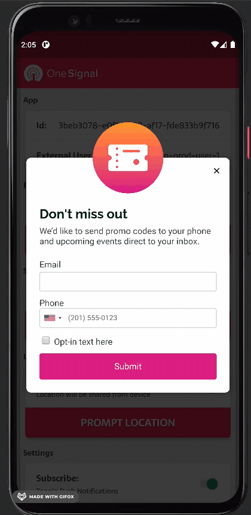
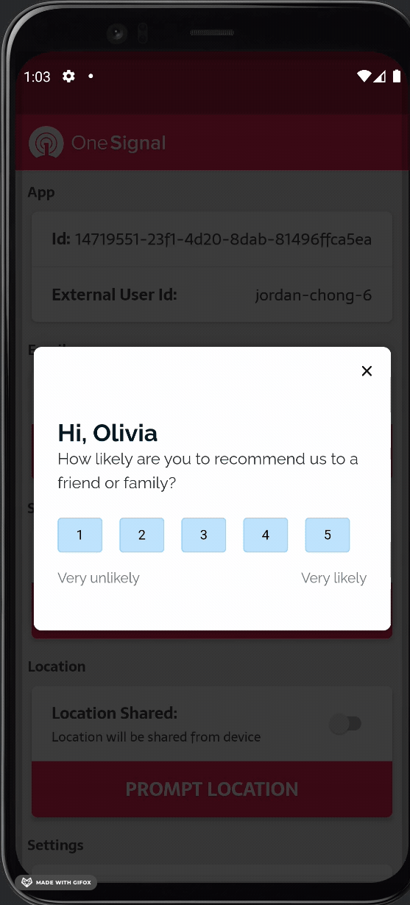
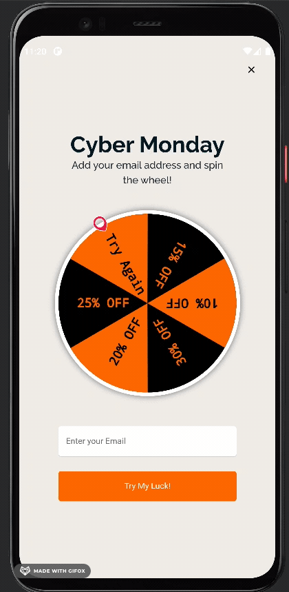
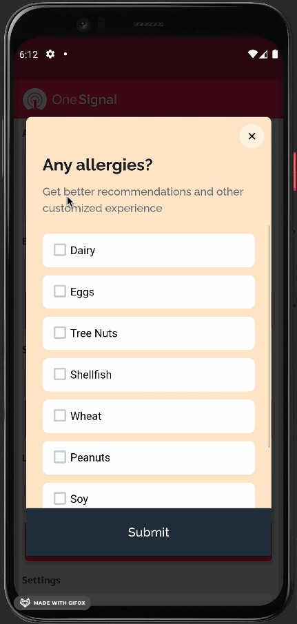

# In-app Messaging HTML Templates

HTML Templates for in-app messaging

For more information on how to build HTML In-App Messages view our [documentation](https://documentation.onesignal.com/docs/design-your-in-app-message-with-html#key-features-with-the-in-app-html-editor) here.

## Templates

For more information of how html in-apps work see our [advanced usage doc](./advanced-usage.md)

###### [Leads (SMS + Email)](./leads/README.md)

###### [Survey (Ranking 1-5)](./ranking_survey)

###### [Promo Wheel](./promo_wheel)

###### [Check List Survey](./check_list_survey)

