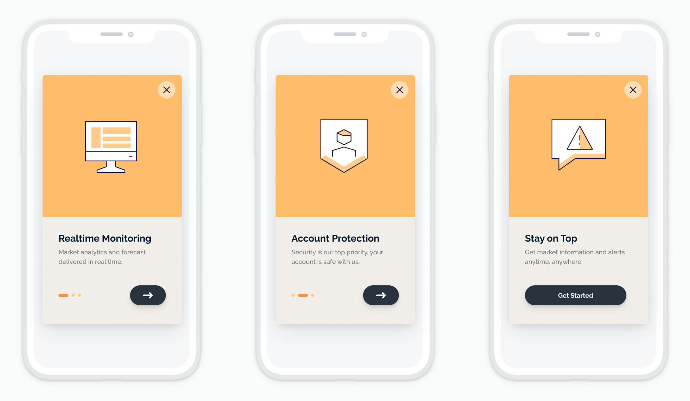

# Carousel Template

[Carousels](https://onesignal.com/carousel) are a great way to convey value to users and encourage them to take an action. They are often used for onboarding, feature announcements, and recommendations. They can also be used to encourage users to accept push notifications, enable location permissions, and to leave an app store review.
Our carousel template provides three cards. However, you can build out up to 10 screens of content in a scrollable carousel format.

## About This Template
This HTML template will demonstrate a custom multi page carousel in-app message. It includes 3 pages laid out side by side. Each page has a button that will navigate to the next page on click. Alternatively, pages can be flipped back and forth using horizontal dragging. Each page includes a copy of a page-indicator which indicates what page you are currently viewing.

## Usage
To utilize the provided javascript in your own custom html in-app, the following document structure is required for compatability. If you chose to change or omit any of these class names then be sure to account for that in the javascript.

- `.outer-content-container`
  - The outer-content-container fills the entire in-app message dimensions is important for binding touch (and mouse) events to.
- `.pages-container`
  - The pages-container is the list of page nodes
- `.page.page-*`
  - Each individual page of the carousel ie. page-1
- `.center-modal`
  - a model added inside the page, remove this for a fullscreen page
- `.carousel-page-indicator`
  - a visual cue to signal which page is currently being viewed
  - it is composed of child `.dot` nodes.
    - `.dot-active` represents the current page. A large of highlighted style is recommended
    - `.dot-inactive-medium` represents inactive and also adjacent pages. A slightly smalled style is recommended
    - `.dot-inactive-small` represents pages that or two or more pages away. An even smaller style is recommended
- `.go-to-next-page`
  - a button that will auto scroll to the next page when clicked
- `.close-button`
  - an svg icon that when clicked with close the in-app message

