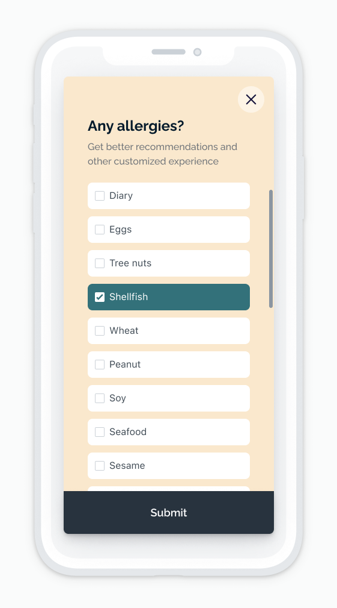

# Check List Survey

Collect data from users through a multiple-choice in-app message question. This template contains one multiple-choice question and presents a good opportunity to collect user information such as personal preferences, dietary restrictions, user feedback, etc. More than one option can be selected in this form, and with the proper APIs calls in place, the data can be collected and converted to user tags.

## About This Template

The check-list survey template demonstrates a scrolling form with custom checkbox styling that requires scrolling to view the overflowed content. It disables the default in-app message behavior of vertical dragging to dismiss so that it won't get mistken for scrolling down the in-app message

