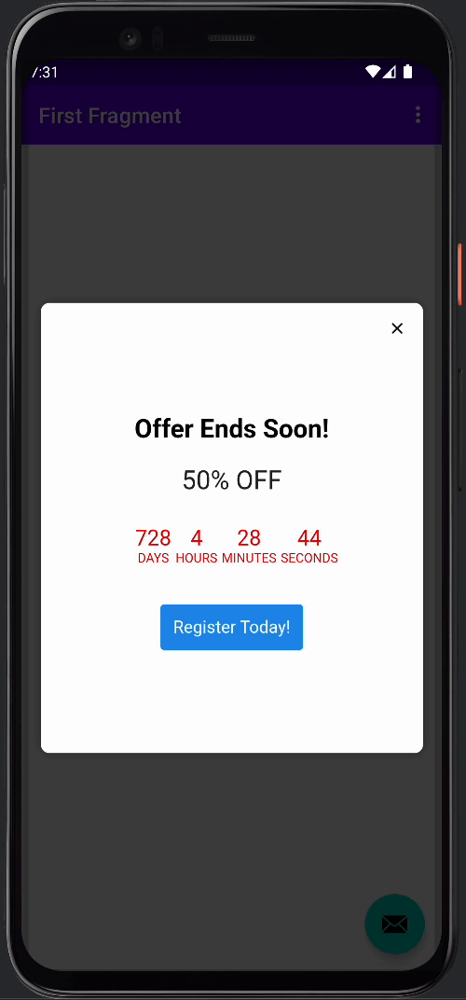

##Countdown (offer) Template

The countdown template enables you to notify users how long they have until an offer expires. This feature not only serves as a convenience, but it can increase registrations/sales due to the fear of missing out. The template is simple to use as you'll only need to provide the date to which the offer expires, then update any necessary messaging details.

## About This Template
To get started, please make sure to set the expiration date within the in-app. We also recommend setting your scheduled "Stop Showing" time to the same expiration date as in your HTML In-App. This will allow the in-app to stop showing once the offer has expired.  
