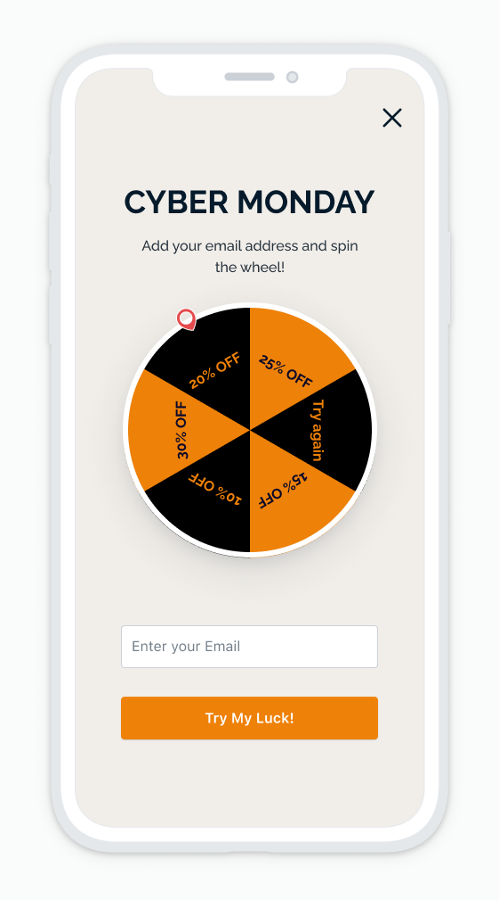

# Promo Wheel Template

The Promo Wheel template enables you to engage users in a fun way. Users can test their luck by spinning the wheel. However, they must first add an email and click on the button. An offer will be randomly generated for the user. To collect email addresses be sure to update the handlePromoReceived with the desired custom behavior. Addresses can be sent to a server directly or to the OneSignal REST API to create a new email player.

## About This Template

This template uses css clip paths to create the promo wheel slices and css animations to rotate the wheel.

https://github.com/OneSignalDevelopers/in-app-html-templates/blob/db2d3e784ff8639335ea9560241212c2d8151909/promo_wheel/index.html#L390-L437

Be sure to take a look at the `handlePromoReceived` function to replace the hardcoded promo codes with some custom behavior.

