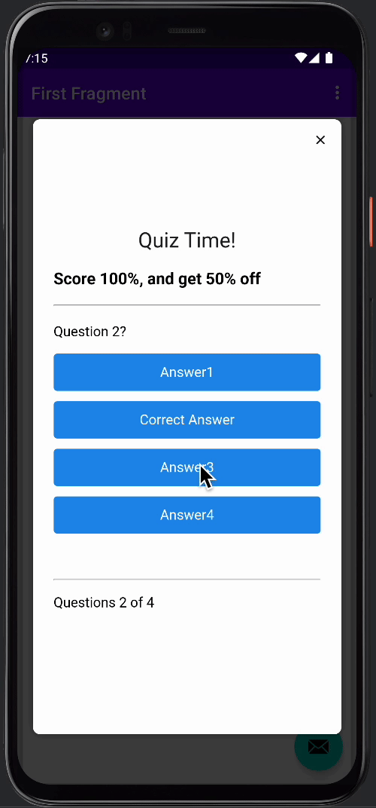

## Quiz Template

The Quiz template enables you to engage users using quizzes. Users can be quizzed on any topic. You have complete control of the questions and answers that will be displayed within the In-App. Once the user completes the quiz, they will be shown their final score. As a bonus, once the In-App is closed, the final score will be set as a data tag on the user's device. This will allow you to give offers or discounts to users who have answered all questions correctly.

## About This Template
To get started, please have 4 questions that you'll like to ask a user. For each question, you'll need to generate 1 correct and 3 incorrect answers.  
