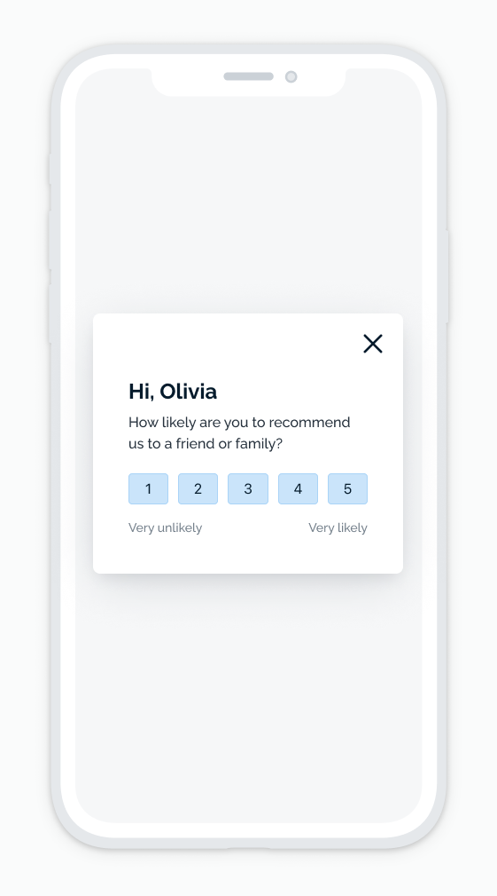

# Survey (Ranking 1-5)
Get feedback and data from users through an in-app message with a single-choice survey. Users can be asked to rate the app between 1 to 5 stars, sad and happy faces, and more. The results are then tracked in the delivery report. 

## About This Template
This HTML template will let you submit a survey with a ranking value between 1-5. You can then add your own click handler to send this value to an API of your choosing.

https://github.com/OneSignalDevelopers/in-app-html-templates/blob/db2d3e784ff8639335ea9560241212c2d8151909/ranking_survey/index.html#L185-L190

Be sure to update the click handlers of each ranking button to submit the request to your API.

